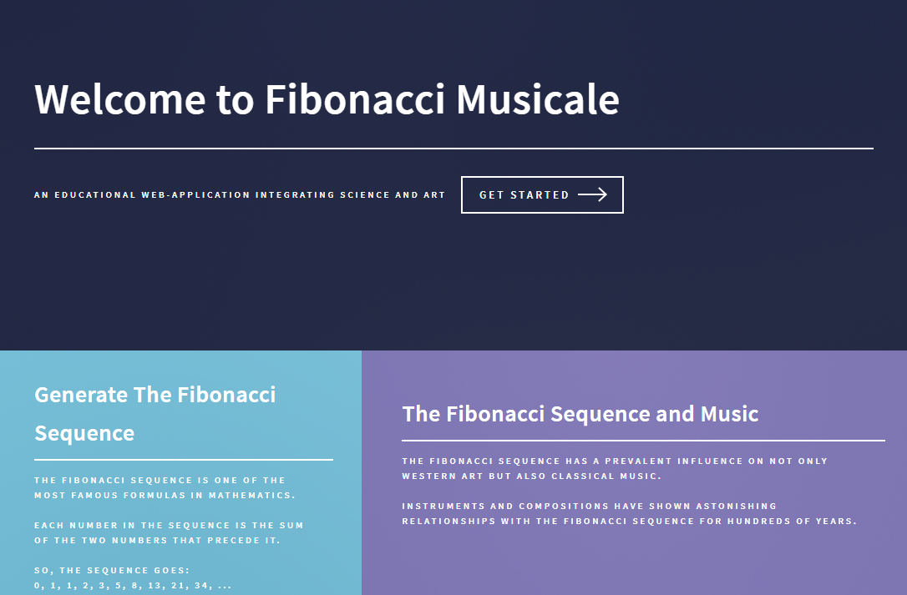
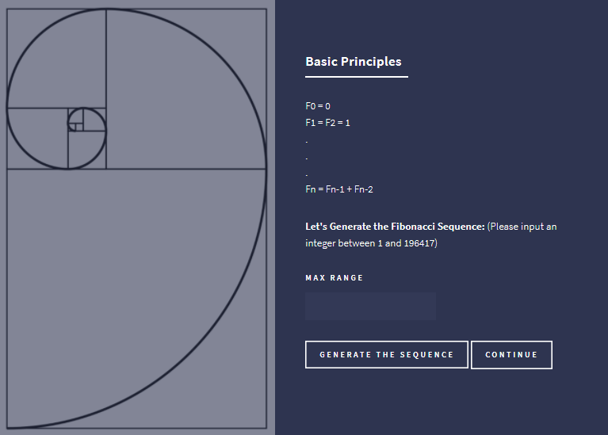
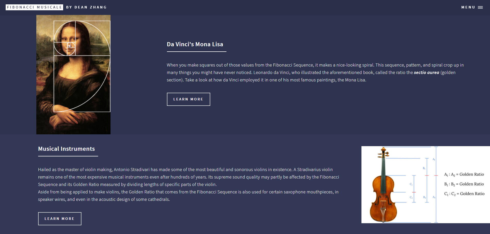

# ***FIBONACCI MUSICALE***

***Fibonacci Musicale*** provides you a journey to discover the relationship between the famous Fibonacci Sequence and art.

## **The Fibonacci Sequence**
The first component of the web-app briefly discuses the historic background and principles of generating the Fibonacci Sequence. The user may input an integer up to which the sequence will be generated.  The challenges of this segment of the web-app lie not only in writing the code for generating the Fibonacci Sequence but also displaying the result back to the multi-layered webpage with ideal fade-in and scrolling styles with Responsive Web Design. 

## **The Sequence and Music**
The second component continues from the Sequences created from the previous page and takes the user to the next step of exploring the relationship of the Sequence and the Golden Ratio through the presentation with multi-media sources.  After comparing the spiral pattern generated from the Sequence with da Vinci's *Mona Lisa*, this section outlines applications of the Sequence and Gold Ratio to music.  The survey ranges from the making of musical instruments to the scales, harmonies, and formal structures of musical compositions. 

***Fibonacci Musicale*** also includes an **About Me** page featuring the author of this web-app.  

The web-app can be view here:
https://fibonacci-musicale.azurewebsites.net/.

